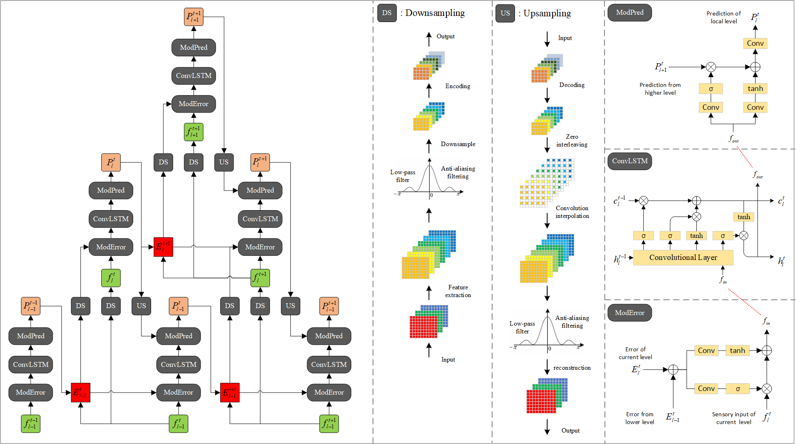
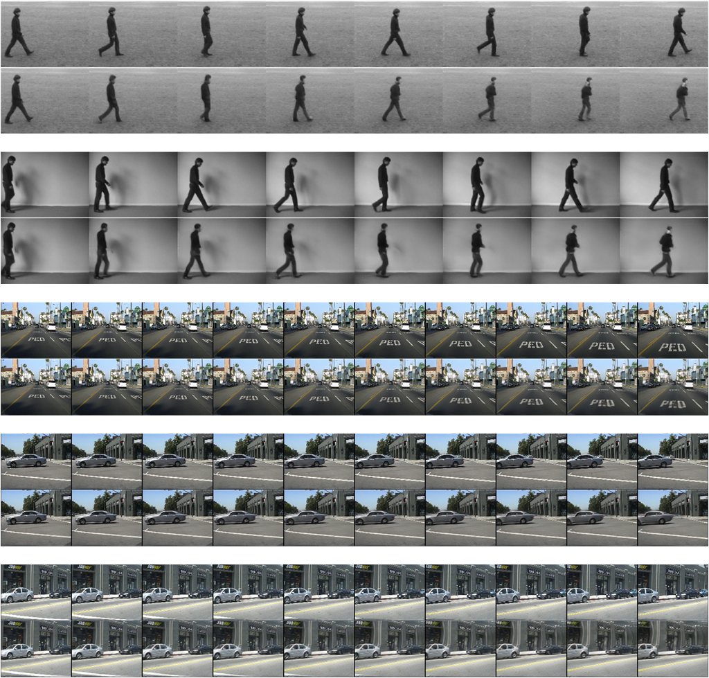

 

 

### Dependencies
* PyTorch, version 1.12.1 or above
* opencv, version 4.6.0 or above
* numpy, version 1.23.4 or above
* skimage, version 0.19.3 or above
* lpips

Please download and process the relevant datasets first. In order to save time, we process the video sequence into data of size (T, C, H, W) in advance, where T represents the length of the sequence, and C, H, W represent the dimension, height and width of the image respectively. We have provided examples for pre-processing of each dataset in this project. In addition, it is recommended to create new folders named "models" and "metric" in the local project to save the training model and evaluation results. Or, you can save it to other paths, but you need to modify the save path specified in the program.

### Model Implementation
* FIRTorch.py, Using pytorch as a platform to implement a low-pass filter with learnable cutoff frequency
* NetworkBlock.py, implementation of the modulation module and upsampling, downsampling artifacts
* ConvLSTM.py, implementation of the convolutioinal LSTM unit
* PPNV2.py, implementation of the complete pyramidal predictive network

### Training and Testing
* train.py, for training
* test.py, for testing

### Others
* utils.py, construction of PyTorch dataset and calculation of loss, etc
